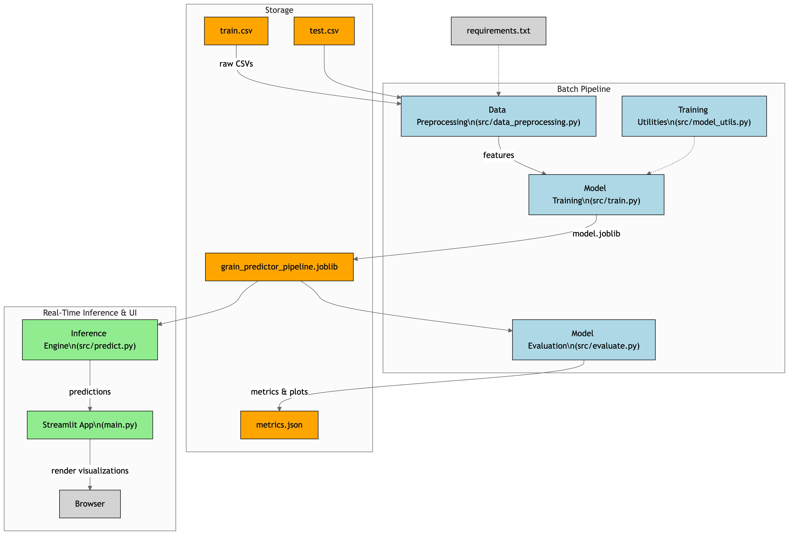

# 🌱 YieldWise: AI-Based Grain Storage Optimization

## Overview

YieldWise is an end-to-end data science application designed to optimize grain storage and prevent spoilage by forecasting inventory longevity. Leveraging a powerful machine learning model, the application provides a proactive, data-driven approach to storage management, allowing users to mitigate risk and maximize the value of their agricultural assets.

This project moves beyond simple monitoring by providing a **predictive decision-support system**. It quantifies the complex relationship between environmental conditions and grain degradation, enabling users to perform "what-if" analysis and make informed, strategic decisions.

---
## 🏗️ System Architecture

Below is the high-level architecture of the YieldWise application, from data generation to the interactive user interface.



---

## 📋 Project Workflow

The project follows a standard machine learning lifecycle:

1.  **Data Generation:** A synthetic dataset is created using `src/generate_dataset.py`, simulating real-world relationships between environmental factors and grain spoilage.
2.  **Model Training:** The `src/train.py` script uses the training data (`data/train.csv`) to train a Gradient Boosting Regressor model. The trained pipeline is then saved.
3.  **Model Evaluation:** The model's performance is rigorously evaluated against unseen test data (`data/test.csv`) using metrics like R², MAE, and a visual "Predictions vs. Actuals" plot.
4.  **Interactive Prediction:** The final, trained model is served through an interactive Streamlit application (`main.py`), allowing users to input live data and receive real-time storage forecasts and what-if analysis.

___

## 🚀 Key Features

* **Predictive Analytics:** Employs a **Gradient Boosting Regressor** to accurately forecast the **Remaining Safe Storage Days (RSSD)** for grain inventory.
* **Interactive Web Dashboard:** A sophisticated and user-friendly UI built with **Streamlit** allows for real-time scenario modeling and risk assessment.
* **Rich Data Visualization:** Integrates **Plotly** to deliver insightful visualizations, including a predictive gauge chart for instant status checks and an interactive line chart for what-if analysis on key environmental factors.
* **Model Transparency:** Features a dedicated "Model Performance" tab that clearly displays key evaluation metrics (**R², MAE, and Accuracy within a Tolerance Range**) and provides a visual deep-dive into model accuracy with a Predictions vs. Actuals scatter plot.
* **Full Data Science Lifecycle:** The repository demonstrates a complete project lifecycle, including synthetic data generation, feature engineering, model training, evaluation, and deployment as an interactive tool.

---

## 🛠️ Tech Stack

* **Language:** Python 3.12
* **Machine Learning:** Scikit-learn, Pandas, NumPy
* **Web Framework & UI:** Streamlit
* **Data Visualization:** Plotly, Matplotlib, Seaborn
* **Jupyter Environment:** Jupyter Notebook, IPyKernel

---

## 📂 Project Structure
The project follows a professional and modular structure to ensure maintainability and scalability.

* **`YieldWise/`**
    * **`data/`**: Contains the training and testing datasets.
        * `train.csv`
        * `test.csv`
    * **`docs/`**: Holds all documentation files.
        * `README.md`
    * **`models/`**: Stores the trained machine learning model.
        * `grain_predictor_pipeline.joblib`
    * **`notebooks/`**: Contains the Jupyter Notebook for data analysis.
        * `EDA.ipynb`
    * **`output/`**: Stores generated files like model metrics.
        * `metrics.json`
    * **`src/`**: Contains all source code for the project.
        * `data_preprocessing.py`
        * `generate_dataset.py`
        * `model_utils.py`
        * `train.py` (Main Training Script)
        * `evaluate.py`
        * `predict.py` (Inference Script)
    * **`main.py`**: The main script to launch the Streamlit web application.
    * **`.gitignore`**: Specifies files and folders for Git to ignore.
    * **`requirements.txt`**: Lists all project dependencies.

---

## ⚙️ Setup & Installation

To set up and run this project on your local machine, please follow these steps.

1.  **Clone the Repository**
    ```bash
    git clone [https://github.com/KumarPranavv/YieldWise.git](https://github.com/KumarPranavv/YieldWise.git)
    cd YieldWise
    ```

2.  **Create and Activate a Virtual Environment**
    ```bash
    # Create the virtual environment
    python3 -m venv myenv

    # Activate it (on macOS/Linux)
    source myenv/bin/activate
    ```

3.  **Install Required Dependencies**
    All project dependencies are listed in the `requirements.txt` file.
    ```bash
    pip install -r requirements.txt
    ```

---

## 🚀 How to Run the Project

Ensure your virtual environment is active before running any commands.

1.  **Train the Machine Learning Model**
    This script will train the Gradient Boosting model, save the final pipeline to the `models/` directory, and store the evaluation metrics in `output/`.
    ```bash
    python src/train.py
    ```

2.  **Launch the Interactive Web Application**
    This is the primary way to use the project. This command will launch the Streamlit dashboard in your web browser.
    ```bash
    streamlit run main.py
    ```

3.  **Perform Exploratory Data Analysis (Optional)**
    To view the data exploration notebook, ensure you have a Jupyter environment running in VS Code and select the `myenv` kernel. You can then run the cells in `notebooks/EDA.ipynb`.

4.  **Run a Standalone Evaluation (Optional)**
    To generate a detailed plot of model predictions vs. actual values:
    ```bash
    python src/evaluate.py
    ```
